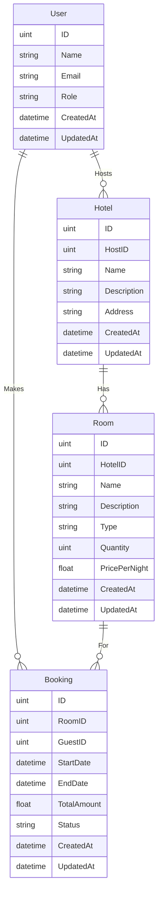
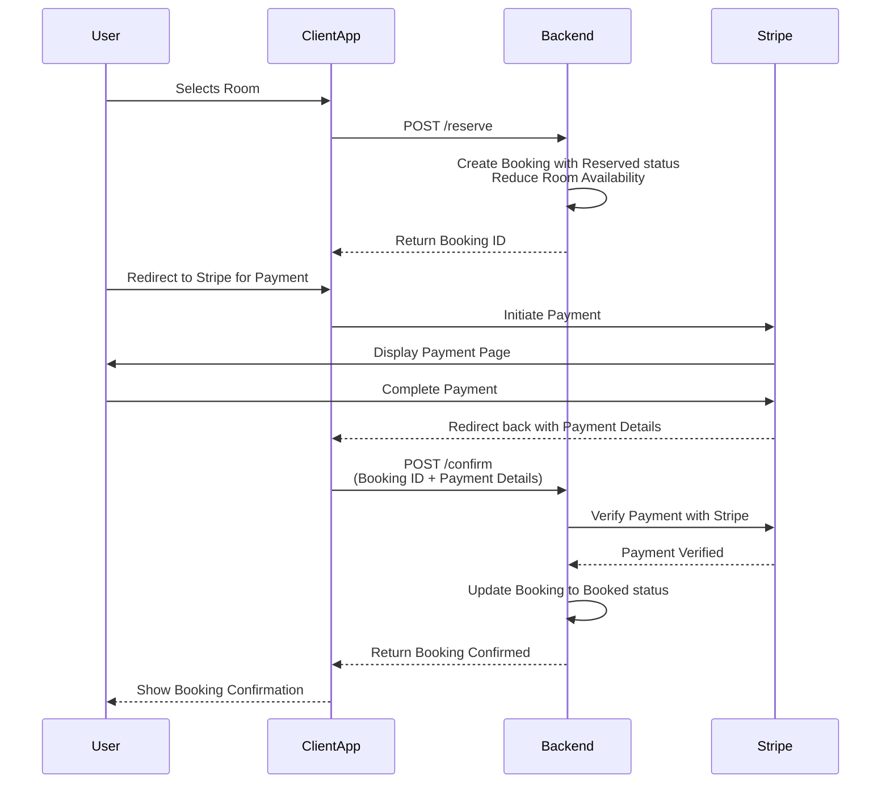

# Data modeling
- Assumption: 
    - Per 1 booking, guest can only book 1 room

```mermaid
erDiagram
    User {
        uint ID
        string Name
        string Email
        string Role
        datetime CreatedAt
        datetime UpdatedAt
    }

    Hotel {
        uint ID
        uint HostID
        string Name
        string Description
        string Address
        datetime CreatedAt
        datetime UpdatedAt
    }

    Room {
        uint ID
        uint HotelID
        string Name
        string Description
        string Type
        uint Quantity
        float PricePerNight
        datetime CreatedAt
        datetime UpdatedAt
    }

    Booking {
        uint ID
        uint RoomID
        uint GuestID
        datetime StartDate
        datetime EndDate
        float TotalAmount
        string Status
        datetime CreatedAt
        datetime UpdatedAt
    }

    User ||--o{ Hotel : "Hosts"
    Hotel ||--o{ Room : "Has"
    User ||--o{ Booking : "Makes"
    Room ||--o{ Booking : "For"

```

# Booking sequence diagram

```mermaid
sequenceDiagram
    participant User
    participant ClientApp
    participant Backend
    participant Stripe

    User->>ClientApp: Selects Room
    ClientApp->>Backend: POST /reserve
    Backend->>Backend: Create Booking with Reserved status<br/>Reduce Room Availability
    Backend-->>ClientApp: Return Booking ID

    User->>ClientApp: Redirect to Stripe for Payment
    ClientApp->>Stripe: Initiate Payment
    Stripe->>User: Display Payment Page

    User->>Stripe: Complete Payment
    Stripe-->>ClientApp: Redirect back with Payment Details

    ClientApp->>Backend: POST /confirm<br/> (Booking ID + Payment Details)
    Backend->>Stripe: Verify Payment with Stripe
    Stripe-->>Backend: Payment Verified

    Backend->>Backend: Update Booking to Booked status
    Backend-->>ClientApp: Return Booking Confirmed

    ClientApp-->>User: Show Booking Confirmation

```